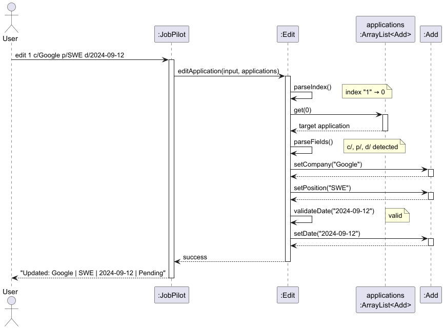
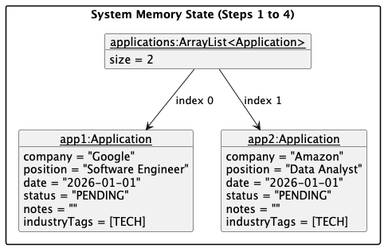
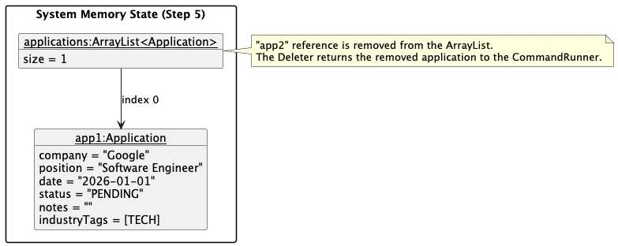
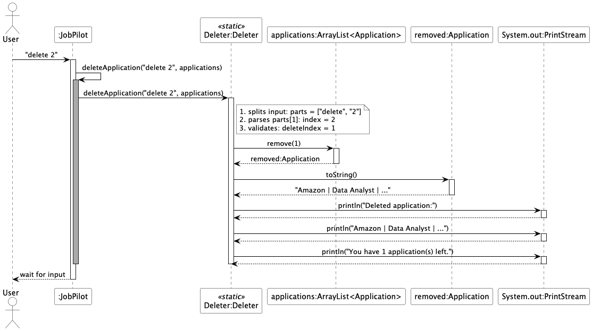

# Developer Guide

## Acknowledgements

{list here sources of all reused/adapted ideas, code, documentation, and third-party libraries -- include links to the original source as well}

## Design & Implementation

{Describe the design and implementation of the product. Use UML diagrams and short code snippets where applicable.}

### Edit Application Feature
The Edit feature allows users to modify existing job applications. This feature was implemented by Labelle.

**Command Format**: edit INDEX [c/COMPANY] [p/POSITION] [d/DATE] [s/STATUS]

All fields after the index are optional. Only specified fields are updated.

Example Usage:
edit 1 c/Microsoft  (Update company only)
edit 2 p/Senior Engineer d/2024-12-01  (Update position and date)
edit 3 s/Interview  (Update status only)

**Implementation Details**

The Edit application feature is implemented through a Edit class:
1.  Extract index from command
2.  Validate index (1 ≤ index ≤ list size)
3.  Retrieve target Add object
4.  Parse remaining command for c/, p/, d/, s/ prefixes
5.  For each field: call corresponding setter on target
6.  Validate date format before setting
7.  Display updated application

**Error Handling**

| Error Scenario | Condition | User Response |
|----------------|-----------|---------------|
| Missing Index | User enters `edit` without a number | "Please provide an index. Example: edit 1 c/Google" |
| Invalid Index | Index is 0, negative, or exceeds list size | "Invalid application number! You have X application(s)." |
| No Fields | User provides index but no fields to update | "No valid fields to update! Use: c/, p/, d/, s/" |
| Invalid Date Format | Date not in `YYYY-MM-DD` format | "Invalid date! Use YYYY-MM-DD (e.g., 2024-09-12)" |

**Sequence Diagram** 

**Design Rationale**

| Decision                             | Rationale                                                        |
|--------------------------------------|------------------------------------------------------------------|
| Separate Edit class                  | Maintains single responsibility and easier to test independently |
| Optional fields                      | Allows partial updates                                           |
| Prefix-based parsing (`c/`, `p/`, `d/`, `s/`) | Consistent with `add` command and easier for users to remember   |
| Date validation                      | Prevents invalid data from entering the system                   |

### Delete Application Feature

#### Implementation Details

The Delete application mechanism is facilitated by the main `JobPilot` class and delegated to a dedicated `Delete` utility class. The application's core state is managed within a single `ArrayList<Add>` named `applications`, which stores all job application entities.

The operations are exposed and handled internally via the following methods:

* `JobPilot#deleteApplication(String, ArrayList<Add>)` — Acts as an intermediate router that intercepts the raw user input and delegates it to the `Delete` class.
* `Delete#deleteApplication(String, ArrayList<Add>)` — Parses the string to extract the target index, validates the bounds against the `ArrayList`, removes the `Add` object, and handles the console output.

Given below is an example usage scenario demonstrating how the Delete mechanism behaves at each step.

**Step 1.** The user executes `delete 2`. The `Scanner` inside the `JobPilot.main()` loop reads the raw input string.

**Step 2.** The `if-else` execution block in `JobPilot.main()` recognizes the `delete` command and routes execution to the private helper method `JobPilot#deleteApplication()`.

**Step 3.** The helper method immediately delegates the operation to the static `Delete.deleteApplication()` method. The `Delete` class splits the raw string by spaces (`input.split(" ")`) to extract the index `"2"`.

**Step 4.** `Delete.deleteApplication()` parses the extracted string into an integer and converts it to a 0-based index (`1`). It validates that the index is within the valid bounds of the `applications` list.

**Step 5.** The target `Add` object is removed via `applications.remove(1)`. Instead of returning control to a UI component, the `Delete` class directly prints the details of the removed object and the remaining application count to `System.out`.

*Note: If the user inputs a non-numeric index (e.g., `delete abc`), a `NumberFormatException` is caught internally by the `Delete` class, which then throws a custom `JobPilotException` back up to the main loop to be displayed.*

The following sequence diagram shows the flow of deleting an application:

#### Design Considerations

**Aspect: Command delegation:**

* **Current Implementation:** The static `Delete` class handles both the domain logic (removing the `Add` object from the `ArrayList`) and the UI logic (printing the success message via `System.out`).
  * *Pros:* Splits the workload of `JobPilot` by extracting the specific deletion into its own class.
  * *Cons:* Increased coupling.
* **Alternative:** Have `Delete.deleteApplication` return the deleted `Add` object.
  * *Pros:* Separates concerns, making the deletion logic purely functional, highly cohesive, and significantly easier to test.
  * *Cons:* Requires refactoring the current architecture, which is difficult due to the given time constraints.

### Search by Company Feature

#### Implementation Details

The **Search by Company** feature allows users to retrieve job applications by matching a company name using a **case-insensitive partial search**. This feature is implemented directly within the `JobPilot` class through the method:

* `JobPilot#searchByCompany(ArrayList<Add>, String)`

The application's data is stored in a central `ArrayList<Add>` named `applications`, where each `Add` object represents a job application.

The search operation works by iterating through the list and checking whether each application's company name contains the user-provided search keyword.

---

Given below is an example usage scenario demonstrating how the search mechanism behaves at each step.

**Step 1.** The user executes `search google`. The `Scanner` inside the `JobPilot.main()` loop reads the raw input string.

**Step 2.** The `if-else` execution block in `JobPilot.main()` recognizes the `search` command and routes execution to the `JobPilot#searchByCompany()` method.

**Step 3.** Inside `searchByCompany`, the system extracts the search keyword using:
`String searchTerm = input.substring("search ".length()).trim();`
If the search term is empty, an error message is shown. If the application list is empty, the system informs the user that there are no applications to search.

**Step 4.** The method iterates through all applications and performs a case-insensitive partial match:
for (Add application : applications) {
if (application.getCompany().toLowerCase().contains(searchTerm.toLowerCase())) {
results.add(application);
}
}

**Step 5.** The results are displayed to the user. If no matches are found, the system prints a corresponding message. Otherwise, all matching applications are listed.

---

The following sequence diagram shows the flow of searching by company:

@startuml
actor User
participant JobPilot
participant "ArrayList<Add>" as AppList
participant Add

User -> JobPilot : input "search google"
JobPilot -> JobPilot : searchByCompany(applications, input)

JobPilot -> JobPilot : extract searchTerm

loop for each application
JobPilot -> Add : getCompany()
Add --> JobPilot : company name
JobPilot -> JobPilot : compare (contains)
end

JobPilot -> User : display results
@enduml

**Sequence Diagram** (command: search google):

| Component | Method Call | Data Flow |
|------|-------------|-----------|
| User | `search google` | → JobPilot |
| JobPilot | `searchByCompany(applications, input)` | → JobPilot |
| JobPilot | `extract searchTerm` | searchTerm = "google" |
| JobPilot | iterate applications | → ArrayList |
| JobPilot | `getCompany()` | ← Add |
| JobPilot | `toLowerCase().contains()` | match check |
| JobPilot | add to results | → results list |
| JobPilot | return results | → JobPilot |
| JobPilot | display results | → User |

---

**Error Handling**

| Error Scenario | Condition | User Response |
|----------------|-----------|---------------|
| Empty Search Term | User enters `search` without keyword | "Please provide a company name to search. Example: search google" |
| No Applications | Application list is empty | "No applications to search!" |
| No Match Found | No company matches the keyword | "No applications found for company: [keyword]" |
| Invalid Format | Input parsing fails unexpectedly | "Invalid search format! Use: search COMPANY_NAME" |

---

**Design Rationale**

| Decision | Rationale |
|----------|----------|
| Implement search in `JobPilot` | Keeps implementation simple and avoids unnecessary abstraction |
| Case-insensitive matching | Improves usability by allowing flexible input |
| Partial matching using `contains()` | Allows users to search with incomplete company names |
| Linear search on `ArrayList` | Sufficient for small datasets and easy to implement |
| Direct result printing | Simplifies control flow without introducing additional layers |

#### Design Considerations

**Aspect: Search logic placement**

* **Current Implementation:** The search logic is implemented directly inside the `JobPilot` class.
  * *Pros:* Simple and straightforward, easy to integrate with the main command loop.
  * *Cons:* Mixes UI logic and business logic, making the method harder to test and reuse.

---

**Aspect: Matching strategy**

* **Current Implementation:** Uses case-insensitive partial matching via `toLowerCase().contains()`.
  * *Pros:* Flexible and user-friendly, supports partial input (e.g., "goo" matches "Google").
  * *Cons:* Less efficient for large datasets and limited to simple substring matching.

* **Alternative:** Use exact matching with `equalsIgnoreCase()`.
  * *Pros:* More precise and slightly more efficient.
  * *Cons:* Too strict for user input, reduces usability.

---

#### Future Improvements

- Support multi-field search (e.g., company + position)
- Implement fuzzy search to handle typos
- Introduce indexing for faster lookup in large datasets
- Separate search logic into its own component for better modularity

### Sort Application Feature

#### Implementation Details

The Sort feature allows users to sort all job applications by date in ascending chronological order. This feature is implemented directly within the `JobPilot` class.

**Command Format**: `sort`

The command does not require any parameters. When executed, all applications are sorted by date automatically.

Example Usage:
- `sort` (Sort all applications by date)

The sorting logic is implemented in the method:

- `JobPilot#sortApplications(ArrayList<Add>)`

Applications are stored in a central `ArrayList<Add>`. The list is sorted using a date comparator: Collections.sort(applications, Comparator.comparing(Add::getDate));

Given below is an example usage scenario:

**Step 1.** The user executes `sort`. Input is read in `JobPilot.main()`.

**Step 2.** The system detects the `sort` command and calls `sortApplications`.

**Step 3.** The method checks if the application list is empty.

**Step 4.** If not empty, the list is sorted in ascending order by date.

**Step 5.** The sorted list is displayed to the user.

---

#### Error Handling

| Error Scenario | Condition | User Response |
|----------------|----------|---------------|
| No Applications | Application list is empty | "No applications to sort!" |

---

#### Design Rationale

| Decision | Rationale |
|----------|----------|
| Sort by date automatically | Most logical for job tracking |
| Ascending order | Ensures earliest applications appear first |
| No command parameters | Keeps command simple and intuitive |
| Use `Collections.sort` | Reliable and easy to maintain |

---

#### Design Considerations

**Aspect: Sorting logic placement**

* **Current Implementation:** Sorting handled in `JobPilot`
  * *Pros:* Simple and direct integration
  * *Cons:* Slight coupling with main class

---

### Tag Industry to Job Application Feature

#### Implementation Details

The Tag feature allows users to add or remove industry tags for job applications. Tags are automatically converted to uppercase and duplicates are prevented. This feature is implemented using a dedicated `IndustryTag` class.

**Command Format**: `tag INDEX add/TAG` or `tag INDEX remove/TAG`

Example Usage:
- `tag 1 add/TECH`
- `tag 2 remove/FINANCE`

The feature is implemented using the following methods:

- `JobPilot#tagApplication(String, ArrayList<Add>)`
- `IndustryTag#executeTagCommand(ArrayList<Add>, String)`

Given below is an example usage scenario:

**Step 1.** The user executes a tag command.

**Step 2.** `JobPilot` routes the command to `IndustryTag`.

**Step 3.** The index, action, and tag content are parsed.

**Step 4.** The target application is retrieved.

**Step 5.** The tag is added or removed:
- Converted to uppercase
- Duplicate tags prevented

**Step 6.** The updated application is displayed.

---

#### Error Handling

| Error Scenario | Condition | User Response |
|----------------|----------|---------------|
| Missing index | No index provided | "Please provide an index. Example: tag 1 add/TECH" |
| Invalid index | Out of bounds | "Invalid application number!" |
| Empty tag | No tag content | "Tag cannot be empty!" |
| Remove non-existent tag | Tag not found | "Tag not found on this application!" |

---

#### Design Rationale

| Decision | Rationale |
|----------|----------|
| Separate `IndustryTag` class | Improves modularity and separation of concerns |
| Uppercase tags | Ensures consistency |
| Deduplication | Prevents redundant data |
| `add/` and `remove/` syntax | Matches existing command patterns |

### Filter by Status Feature

#### Implementation Details
The **Filter by Status** mechanism allows users to retrieve a subset of applications matching a specific status (e.g., "OFFER"). This is implemented via a dedicated `Filterer` utility class and a `FilterParser` sub-parser, following the **Separation of Concerns** principle used in the `Delete` and `Edit` features.

The operations are handled via the following methods:
* `FilterParser#parse(String)` — Extracts the status query from the raw input (e.g., extracts "OFFER" from `filter status/OFFER`).
* `Filterer#filterByStatus(ArrayList<Application>, String, Ui)` — Iterates through the list, performs the logical match, and delegates the display to the `Ui` class.

**Execution Scenario**

**Step 1.** The user executes `filter status/OFFER`. The `Scanner` in `JobPilot.main()` reads the input string.

**Step 2.** The `Parser` identifies the `filter` keyword and routes execution to `FilterParser.parse("filter status/OFFER")`.

**Step 3.** `FilterParser` validates the `status/` prefix, extracts the string `"OFFER"`, and returns a `ParsedCommand` object with `type = FILTER` and `searchTerm = "OFFER"`.

**Step 4.** The `switch` block in `JobPilot.main()` catches the `FILTER` case and calls `Filterer.filterByStatus(applications, cmd.searchTerm, ui)`.

**Step 5.** The `Filterer` iterates through the `ArrayList<Application>`. For each application, it performs a case-insensitive check:
`app.getStatus().toUpperCase().contains(query.toUpperCase())`.

**Step 6.** Matching applications are added to a temporary results list, which is then passed to `ui.showApplicationList(results)` for final display.

#### Design Rationale

| Decision | Rationale |
|----------|-----------|
| **Separate `Filterer` Class** | Maintains the Single Responsibility Principle and simplifies unit testing. |
| **Case-Insensitive `contains()`** | Provides a "search-like" experience, allowing partial matches (e.g., "OFF" matches "OFFER"). |
| **Logging (v2.0 requirement)** | Uses `java.util.logging` to track filter queries for developer diagnostics. |

#### Error Handling

| Error Scenario | Condition | User Response |
|----------------|-----------|---------------|
| Missing Arguments | User enters `filter` alone | "Filter command is missing arguments! Use: filter status/STATUS" |
| Missing Prefix | User enters `filter PENDING` | "Invalid filter format! Expected: filter status/STATUS" |
| Empty Value | User enters `filter status/` | "Status value cannot be empty!" |

### Separate Notes from Status Feature

#### Implementation Details

This feature separates the original `status` field into `status` and `notes`, allowing independent updates.

**Command Format**: `status INDEX set/STATUS note/NOTES`

Example Usage:
- `status 1 set/OFFER note/Negotiate salary`
- `status 2 set/INTERVIEW note/Prepare portfolio`

The feature is implemented in:

- `JobPilot#updateStatus(String, ArrayList<Add>)`

Given below is an example usage scenario:

**Step 1.** The user executes a status command.

**Step 2.** Input is parsed to extract index, status, and notes.

**Step 3.** The target application is retrieved.

**Step 4.** `setStatus()` and `setNotes()` are called.

**Step 5.** The updated application is displayed.

---

#### Error Handling

| Error Scenario | Condition | User Response |
|----------------|----------|---------------|
| Missing index | No index provided | "Please provide an index." |
| Invalid index | Out of range | "Invalid application number!" |
| Invalid format | Incorrect syntax | "Invalid status format!" |
| Empty status | No status given | "Status cannot be empty!" |

---

#### Design Rationale

| Decision | Rationale |
|----------|----------|
| Separate status and notes | Improves clarity of data |
| Dedicated command | Keeps logic focused |
| `note/` prefix | Supports multi-word notes |
| Backward compatibility | Existing data remains valid |

## Product scope
### 
  profile

  students or job seekers looking for an efficient way to track internship and full-time job applications using a CLI interface.

### Value proposition
In the current job market, applying to many roles has become the norm. As such, JobPilot acts a 
tracker to allow users to get a bird's eye view of all their applications and manage them effectively.

## User Stories

| Version | As a ... | I want to ...                      | So that I can ...                                           |
|---------|----------|------------------------------------|-------------------------------------------------------------|
| v1.0    | user     | delete applications                | manage my application list effectively.                     |
| v2.0    | user     | store my applications persistently | come back to it at different points in time.                |
| v2.0    | user     | find a to-do item by name          | locate a to-do without having to go through the entire list |

## Non-Functional Requirements

### 1. Performance
- The application shall respond to any command (add, edit, delete, search, sort, tag, status) within **1 second** for up to **500 job applications**.
- Searching, sorting, and filtering operations shall execute in **O(n)** time complexity or better, where n is the number of applications.

### 2. Usability
- Command syntax shall remain consistent with clear prefixes (`c/`, `p/`, `d/`, `s/`, `add/`, `remove/`, `note/`) to minimize user errors.
- Error messages shall be **descriptive and actionable**, guiding users to correct input mistakes.
- Commands shall support **partial input** where applicable (e.g., partial company names for search).

### 3. Accessibility
- Command-line outputs shall be **readable with standard font sizes**, use clear formatting (tables, line breaks), and avoid color dependence.
- Messages shall be concise, avoiding technical jargon when addressing end users.

## Glossary

* **CLI** - Command Line Interface.
* **Filter** - A function to narrow down the application list based on specific criteria.
* **Tag** - A label assigned to an application for categorization.

## Instructions for manual testing

{Give instructions on how to do a manual product testing e.g., how to load sample data to be used for testing}

## Initial Launch
1. Use the provided `JobPilot.jar`.
2. Place the jar in an empty folder.
3. **Double-click the jar file**  
   **Expected:** JobPilot launches. The CLI prompt appears showing either an empty list or existing applications if data file exists.

### Edit Feature Testing

| Test          | Command | Expected |
|---------------|---------|----------|
| Edit company  | `edit 1 c/Microsoft` | Company updated |
| Edit position | `edit 1 p/Senior Engineer` | Position updated |
| Edit date     | `edit 1 d/2024-12-01` | Date updated |
| Edit status   | `edit 1 s/Interview` | Status updated to Interview |
| Edit multiple | `edit 1 c/Google p/SWE d/2024-09-12` | All fields updated |
| Invalid index | `edit 99 c/Google` | Error: invalid index |
| No fields     | `edit 1` | Error: no fields to update |
| Invalid date  | `edit 1 d/2024-13-01` | Error: invalid date format |

### Search by Company Feature Testing

| Test | Command | Expected |
|------|--------|----------|
| No match | `search Microsoft` | Prints "No applications found for company: Microsoft" |
| Exact match | `search Google` | Shows 1 result with Google application only |
| Partial match | `search Go` | Shows multiple results (e.g., Google, GoGoTravel) |
| Case insensitive | `search GOOGLE` | Matches "Google" successfully |
| Empty search term | `search ` | Error: "Please provide a company name to search" |
| Empty list | `search Google` (no applications) | "No applications to search!" |

### Filter by Status Feature Testing

| Test | Command | Expected |
|------|---------|----------|
| Exact match | `filter status/OFFER` | Shows only applications with status "OFFER" |
| Case insensitive | `filter status/offer` | Matches "OFFER" successfully |
| Partial match | `filter status/PEND` | Matches "PENDING" successfully |
| No match | `filter status/REJECTED` | Prints "No applications found for status: REJECTED" |
| Empty list | `filter status/OFFER` | Prints "There is no application yet." |
### Delete Feature Testing

#### Test case: `delete 1`

- **Action:** Enter `delete 1`
- **Expected:**
  - First application removed from list.
  - `Ui.showApplicationDeleted()` shows the deleted application and remaining count.
  - `Storage.saveToFile()` updates `JobPilotData.txt`.

#### Test case: `delete 0`

- **Action:** Enter `delete 0`
- **Expected:**
  - Error thrown.
  - No deletion occurs.
  - Storage remains unchanged.

#### Test case: `delete` (no index)

- **Action:** Enter `delete`
- **Expected:**
  - Error thrown.
  - No deletion.
  - Data file remains unchanged.

#### Test case: `delete x` (non-numeric index)

- **Action:** Enter `delete abc`
- **Expected:**
  - Error thrown.
  - No deletion.
  - Storage remains consistent.

#### Test case: `delete N+1` (index out of range)

- **Action:** Enter index greater than list size
- **Expected:**
  - Error thrown.
  - No deletion occurs.
  - Data file unchanged.

### Storage Feature Testing

1. Perform `add`, `edit`, or `delete` command.  
   **Expected:**
  - `Storage.saveToFile()` is called.
  - `JobPilotData.txt` updated with the latest application list.
  - On next launch, the list reflects all modifications.
  
  

  