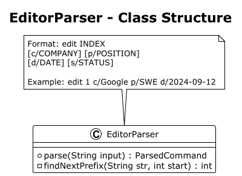
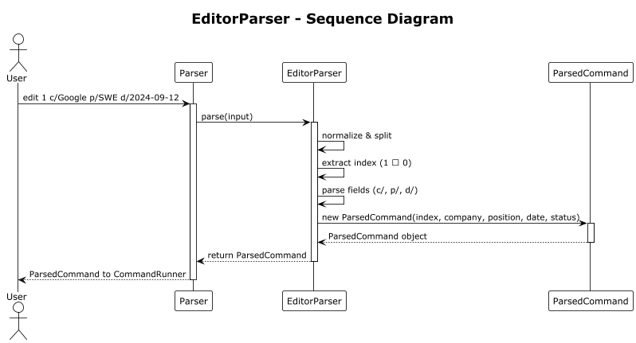
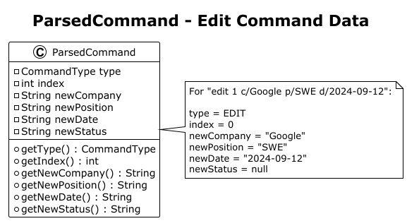
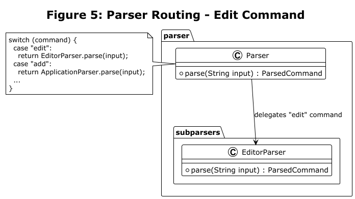
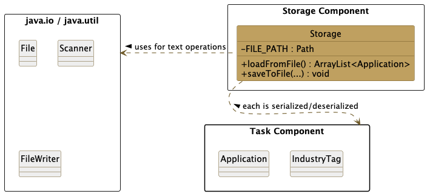
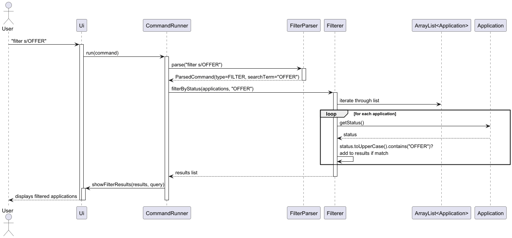

# Developer Guide

## Acknowledgements

This project was guided by the [SE-EDU initiative's](https://se-education.org) AddressBook-Level3 (AB3). We took guidance from its core architecture, parser design, 
and command execution flow to better suit JobPilot.
  
## Design

### UI Component

The API of this component is specified in `Ui.java`.

The UI consists of a centralized `Ui` class that serves as the boundary between the user and the system. Since it is a CLI application, it relies on standard input and output.

The `UI` component uses the standard Java `Scanner` to capture user input. The formatting for UI outputs (e.g., the welcome logo, help menus, and application lists) is defined directly within the `Ui` class using text blocks and formatted strings.

The `UI` component,

* reads raw user commands from the console.
* displays formatted messages, search results, and errors to the user based on command execution.
* operates passively; it relies on the `JobPilot` main loop and `CommandRunner` to invoke its specific display methods (e.g., `showApplicationAdded`, `showSearchResults`).
* depends on some classes in the `task` component, as it displays `Application` and `IndustryTag` objects.

### Parser Component

The **Parser** component is responsible for interpreting raw user input and converting it into structured `ParsedCommand` objects.

*Figure 1: Class Structure*

The EditorParser handles the parsing of edit commands. 

*Figure 2: Sequence Diagram*

The sequence diagram shows the interaction flow for parsing an edit command.

*Figure 3: ParsedCommand*

When parsing is successful, the EditorParser returns a ParsedCommand object.

*Figure 4: Integration with Main Parser*

The main Parser routes the edit command to EditorParser based on the command keyword.

### Storage Component

The **API** of this component is specified in `Storage.java`.

The `Storage` component,

* Can save job application data in **JSON format (`.json`)**, and read them back into corresponding `Application` objects.
* Handles missing directories or files automatically by creating the necessary `data/JobPilotData.json` file upon initialization if it does not exist.
* Implements **defensive parsing** to ensure the application never crashes upon startup:
  * If individual application entries are missing required fields (caught by `filterValidApplications()`), the component safely skips the corrupted entry and continues loading the rest of the data.
  * Optional fields (`notes`, `industryTags`) must be present in the JSON structure; entries missing these fields are also treated as corrupted and skipped to maintain strict storage consistency.
  * If the entire file is structurally malformed (e.g., `JsonParseException`), it catches the error, delegates a warning to the `Ui` component, and boots up with a new empty list.
* Depends on classes in the `task` component, because the `Storage` component's primary job is to save and load `Application` and `IndustryTag` objects.
* Utilizes the external **Gson** library for all JSON-related saving and loading processes.

### CommandRunner Component

The **CommandRunner** component serves as the central router for all user commands. It receives a `ParsedCommand` object from the `Parser` and delegates execution to the appropriate handler.

The `CommandRunner` component,

* receives a `ParsedCommand` containing command type and relevant parameters (index, search term, status, notes, tag, etc.).
* maintains the central `ArrayList<Application>` that holds all job applications.
* validates command parameters (e.g., index bounds) before delegating to specialized handlers.
* coordinates between the `Ui` and domain logic classes (`Deleter`, `Editor`, `Filterer`, etc.).
* returns a boolean flag to indicate whether the application should continue running.

The following diagram illustrates how the `CommandRunner` processes different command types:

**Key Responsibilities:**

| Responsibility | Description |
|----------------|-------------|
| **Command Routing** | Uses a switch statement to route `ParsedCommand` to the appropriate handler based on `CommandType` |
| **Index Validation** | Validates that indexes are within bounds before passing to handlers |
| **State Management** | Maintains the single source of truth for the application list |
| **Error Handling** | Catches exceptions and delegates error display to `Ui` |

**Command Types Handled:**

| Command Type | Handler | Description |
|--------------|---------|-------------|
| `ADD` | `Application` constructor | Creates new application and adds to list |
| `DELETE` | `Deleter` | Removes application from list |
| `EDIT` | `Editor` | Updates fields of existing application |
| `LIST` | `Ui.showApplicationList()` | Displays all applications |
| `SORT` | `CommandRunner` + `Collections.sort()` | Sorts applications by date, company, or status (optional `reverse`) |
| `SEARCH` | `CommandRunner` + `SearcherParser` | Case-insensitive partial match on company, position, or status |
| `FILTER` | `Filterer` | Filters applications by status |
| `STATUS` | `Application.setStatus()` / `setNotes()` | Updates status and/or notes |
| `TAG` | `Application.addIndustryTag()` / `removeIndustryTag()` | Adds or removes industry tags |
| `HELP` | `Ui.showHelp()` | Displays available commands |
| `BYE` | None | Exits the application |

**Design Rationale:**

| Decision | Rationale |
|----------|-----------|
| Centralized command routing | All commands flow through a single component, making the execution flow easy to trace |
| Validation before delegation | Ensures invalid commands never reach domain logic, improving robustness |
| Return boolean flag | Simple mechanism to control main loop continuation without exceptions |
| Switch statement over mapping | Simple, readable, and sufficient for the number of command types |

## Implementation

### Editor Application Feature

#### Sequence Diagram

*Figure 3: Editor Feature Sequence Diagram*

**Error Handling**

| Error Scenario | Condition | User Response |
|----------------|-----------|---------------|
| Missing Index | User enters `edit` without a number | "Please provide an index. Example: edit 1 c/Google" |
| Invalid Index | Index is 0, negative, or exceeds list size | "Invalid application number! You have X application(s)." |
| No Fields | User provides index but no fields to update | "No valid fields to update! Use: c/, p/, d/, s/" |
| Invalid Date Format | Date not in `YYYY-MM-DD` format | "Invalid date! Use YYYY-MM-DD (e.g., 2024-09-12)" |

### Delete Application Feature

#### Implementation Details

The Delete application mechanism is facilitated by the `CommandRunner` component, which manages the application's core state through an `ArrayList<Application>` named `applications`.

The operations are exposed and handled internally via the following flow:

* `DeleterParser#parse(String)` — Parses the raw user input to extract the target index, converting it to a 0-based index and returning a structured `ParsedCommand` object.
* `CommandRunner#run(ParsedCommand)` — Acts as the central router, matching the `DELETE` command type and coordinating between the logic and UI components.
* `Deleter#deleteApplication(ArrayList<Application>, int)` — Validates the array bounds, removes the target `Application` object from the memory list, and returns the removed object.
* `Ui#showApplicationDeleted(Application, int)` — Handles the console output to inform the user of the successful deletion.

Given below is an example usage scenario demonstrating how the Delete mechanism behaves at each step.

**Step 1.** The user executes `delete 2`. The `Ui.readCommand()` method captures the raw input string.

**Step 2.** The input is passed to `Parser.parse()`, which identifies the `delete` keyword and delegates to `DeleterParser.parse()`.

**Step 3.** `DeleterParser` splits the string, extracts the index `"2"`, converts it to a 0-based integer (`1`), and packages it into a `ParsedCommand(type=DELETE, index=1)` object.

**Step 4.** The `CommandRunner#run()` method receives the `ParsedCommand`. The `switch` statement recognizes the `DELETE` type and invokes `Deleter.deleteApplication(applications, cmd.index)`.

**Step 5.** `Deleter` validates that index `1` is within the valid bounds of the `applications` list. It removes the target `Application` object via `applications.remove(1)` and returns the deleted object back to the `CommandRunner`.

**Step 6.** `CommandRunner` receives the deleted `Application` and passes it to `Ui.showApplicationDeleted(removed, applications.size())`, which safely prints the confirmation message to the console.

*Note: If the user inputs a non-numeric index (e.g., `delete abc`), a `NumberFormatException` is caught internally by the `DeleterParser`, which then throws a custom `JobPilotException`. This exception is caught in `Parser`, which directly calls `Ui.showError()` to display the message to the user, and returns null to safely bypass the `CommandRunner` execution.

The following sequence diagram shows the flow of deleting an application:

#### Design Considerations

**Aspect: Command delegation and Separation of Concerns:**

* **Current Implementation:** The `Deleter` class is strictly responsible for domain logic (removing the `Application` object from the `ArrayList`) and returns the deleted object back to the caller. It does not contain any `System.out.println` statements.
  * *Pros:* High cohesion and loose coupling. By returning the object rather than printing directly, the deletion logic becomes purely functional. This makes `Deleter` extremely easy to unit test and ensures that formatting changes only need to be made in the `Ui` class.
  * *Cons:* Requires a slightly longer call chain (Parser -> Runner -> Deleter -> Ui) compared to a monolithic approach.
* **Alternative:** Have `Deleter.deleteApplication` handle the `ArrayList` removal and print the success message directly to the console.
  * *Pros:* Less boilerplate code and fewer method hand-offs in the `CommandRunner`.
  * *Cons:* Violates the Single Responsibility Principle (SRP) by mixing domain logic with presentation logic, making automated testing difficult and UI migrations (e.g., moving to a GUI) nearly impossible.

### Multi-Type Search Feature

#### Implementation Details

The **Multi-Type Search** feature supports one prefix per command:

- `search c/KEYWORD` for company
- `search p/KEYWORD` for position
- `search s/KEYWORD` for status

`SearcherParser` validates command structure and extracts `(type, query)`.  
`CommandRunner#handleSearch` iterates through the `applications` list, performs case-insensitive partial matching (`contains`), sorts matched results by date, and delegates output to `Ui.showSearchResults`.

Typical flow:
1. User input is parsed by `Parser` -> `SearcherParser`.
2. Validation errors (empty term, invalid prefix/format) are surfaced via `Ui.showError`.
3. Valid searches are executed by `CommandRunner`, then displayed by `Ui`.

---

#### Sequence Diagrams
##### Main Success Flow
The following diagram illustrates the normal execution flow when a user performs a valid search:

##### Empty Search Term
The following diagram shows the system behavior when the user provides an empty search keyword:

##### No Match Found
The following diagram illustrates the case where no applications match the search keyword:

---
**Error Handling**

| Error Scenario       | Condition                                      | User Response                                                |
|---------------------|-----------------------------------------------|-------------------------------------------------------------|
| Empty Search Term     | User enters `search c/`, `p/`, or `s/` without keyword | "Search value cannot be empty!"                              |
| No Applications       | Application list is empty                     | "Application list is empty!"                                 |
| No Match Found        | No application matches the keyword           | "No applications found matching '[type]/[keyword]'."         |
| Invalid Format        | Input does not follow `search c/xxx`, `p/xxx`, or `s/xxx` | "Invalid format! Use: search c/xxx or p/xxx or s/xxx"        |
| Invalid Search Type   | Type is not `c`, `p`, or `s`                 | "Invalid search type! Use c/, p/, or s/"                     |

---

**Design Rationale**

| Decision                            | Rationale                                                                 |
|------------------------------------|---------------------------------------------------------------------------|
| Implement search in `CommandRunner` | Keeps parsing in `SearcherParser` and matching next to other list operations |
| Support multiple search types       | Improves usability by allowing field-specific searches                  |
| Case-insensitive matching           | Flexible input, user-friendly                                           |
| Partial matching using `contains()` | Allows users to search with incomplete input                             |
| Linear search on `ArrayList`        | Adequate for small datasets, simple to implement                         |
| Direct result printing               | Simplifies control flow without extra layers                             |

---

#### Design Considerations

**Aspect: Search logic placement**

* **Current Implementation:** The search logic is implemented in `CommandRunner` with parsing in `SearcherParser`.
    * *Pros:* Clear separation between parsing and execution; list logic stays in one place.
    * *Cons:* `CommandRunner` still coordinates UI calls for results.

### Sort Application Feature

#### Implementation Details

The Sort feature sorts all job applications **in place** in the central `ArrayList<Application>`. Users may sort by **submission date** (default), **company name**, or **status**, in ascending order or **reverse** order.

**Command format** (parsed by `Parser`; optional argument passed as `ParsedCommand` search term):

- `sort` — by date, ascending
- `sort date` / `sort company` / `sort status` — by that field, ascending
- `sort <field> reverse` — descending for that field (e.g. `sort company reverse`)

The sorting logic lives in `CommandRunner#handleSort(String rawSortTerm)`:
- validates tokens (`field` + optional `reverse`)
- selects comparator by field
- applies ascending/descending sort
- prints summary via `Ui.showSortedMessage` and list via `Ui.showApplicationList`

If tokens are invalid (e.g. `sort hi`), the method reports an error and leaves list order unchanged.

---

#### Error Handling

| Error Scenario | Condition | User Response |
|----------------|----------|---------------|
| No Applications | Application list is empty | "There is no application yet." |
| Invalid sort field | e.g. `sort hi` | "Invalid sort field! Use: sort [date, company, or status] [reverse]" |

---

#### Design Rationale

| Decision | Rationale |
|----------|----------|
| Optional sort field | Matches User Guide; date remains the default when omitted |
| Reverse keyword | Single consistent modifier instead of separate commands |
| Sort in `CommandRunner` | Same list instance as other commands; no extra copies |
| Use `Collections.sort` | Reliable and easy to maintain |

---

#### Design Considerations

**Aspect: Sorting logic placement**

* **Current Implementation:** Sorting handled in `CommandRunner`
  * *Pros:* Stays next to `SEARCH`, `FILTER`, and list display
  * *Cons:* `CommandRunner` grows with feature set

### Tag Industry to Job Application Feature

#### Implementation Details

The Tag feature allows users to add or remove industry tags for job applications. Tags are automatically normalized to uppercase, trimmed of whitespace, and duplicates are automatically prevented. This feature is implemented using a dedicated `IndustryTag` class and integrated with the `Application` model.

**Command Format**:
- `tag INDEX add/TAG` — Add a tag to an application
- `tag INDEX remove/TAG` — Remove a tag from an application

**Example Usage**:
- `tag 1 add/TECH` — Adds tag "TECH" to application at index 1
- `tag 2 remove/FINANCE` — Removes tag "FINANCE" from application at index 2

Main components:
- `IndustryTag` — Immutable value object representing a normalized tag
- `Application` — Stores a `Set<IndustryTag>` and provides `addIndustryTag()` and `removeIndustryTag()` methods
- `CommandRunner` — Routes the command to the appropriate handler
- `TaggerParser` — Parses the raw input to extract index, action, and tag content

Execution summary:
1. `Parser` delegates `tag` commands to `TaggerParser`.
2. `TaggerParser` validates index/action/tag and returns `ParsedCommand`.
3. `CommandRunner` validates index and applies add/remove on the target `Application`.
4. `Ui` prints success output or explicit error (duplicate tag / missing tag).

#### Sequence Diagram

The following sequence diagram illustrates the flow of adding a tag to an application:

#### Error Handling

| Error Scenario | Condition | User Response |
|----------------|-----------|---------------|
| Missing index | User enters `tag add/TECH` without index | "Please provide an index. Example: tag 1 add/TECH" |
| Invalid index | Index is 0, negative, or exceeds list size | "Invalid application number! You have X application(s)." |
| Invalid format | Missing `add/` or `remove/` prefix | "Invalid tag format! Use: tag INDEX add/TAG or tag INDEX remove/TAG" |
| Empty tag | User enters `tag 1 add/` | "Tag cannot be empty!" |
| Duplicate tag | User adds a tag already on the application | "This application already has that tag." |
| Remove non-existent tag | Tag not found on application | "Tag not found on this application!" |

#### Design Rationale

| Decision | Rationale |
|----------|----------|
| Dedicated `IndustryTag` class | Encapsulates tag normalization logic (uppercase, trim) and ensures immutability |
| Use `Set<IndustryTag>` | Automatically prevents duplicate tags |
| Tag normalization (uppercase) | Ensures consistency and prevents case-sensitive duplicates |
| `add/` and `remove/` syntax | Matches existing command patterns (`set/`, `note/`) |
| Separate `TaggerParser` | Maintains separation of concerns and simplifies unit testing |

### Filter by Status Feature

#### Implementation Details

The **Filter by Status** mechanism allows users to retrieve a subset of applications matching a specific recruitment status. This feature is implemented using a dedicated `Filterer` utility class and a `FilterParser` sub-parser, following the **Separation of Concerns** principle used across other commands such as `delete` and `edit`.

The operations are handled via the following methods:
* `FilterParser#parse(String)` — Extracts and validates the status query from the raw input (e.g., extracts `OFFER` from `filter s/OFFER`), while enforcing correct prefix usage.
* `Filterer#filterByStatus(ArrayList<Application>, String)` — Iterates through the application list and performs case-insensitive partial matching using `contains()`, before delegating results to the `Ui` component.

---

#### Execution Summary

1. `Parser` routes `filter` input to `FilterParser`.
2. `FilterParser` validates format integrity (ensuring `s/` is present and no junk text exists before the prefix).
3. The parsed status keyword is extracted and returned as a `ParsedCommand`.
4. `CommandRunner` delegates execution to `Filterer.filterByStatus(...)`.
5. `Filterer` performs case-insensitive partial matching on application status.
6. Matching results are passed to `Ui.showFilterResults()` for display.

---

#### Sequence Diagram

The following sequence diagram illustrates the flow of filtering applications by status:

---

#### Design Rationale

| Decision | Rationale |
|----------|-----------|
| **Separate `Filterer` Class** | Maintains the Single Responsibility Principle by isolating filtering logic from parsing and UI responsibilities, improving modularity and testability. |
| **Case-Insensitive Partial Matching (`contains`)** | Supports flexible "smart matching" behaviour, allowing partial inputs such as `off` to match `OFFER`, and `p` to match both `PENDING` and `PROCESSING`. This aligns with the User Guide specification. |
| **Linear Scan over `ArrayList`** | Simple and efficient for the expected dataset size (≤ 500 applications), avoiding unnecessary complexity while maintaining acceptable performance. |

---

#### Error Handling

| Error Scenario | Condition | User Response |
|----------------|-----------|---------------|
| Missing Arguments | User enters `filter` alone | "Filter command is missing arguments! Use: filter s/STATUS" |
| Missing Prefix | User enters `filter PENDING` | "Invalid filter format! Expected: filter s/STATUS" |
| Empty Value | User enters `filter s/` | "The filter value cannot be empty! Please provide a status after 's/'." |
| Format Violation | Junk text appears before `s/` | "Invalid filter format! Unexpected input before prefix." |

---

#### Design Considerations

* The parser enforces **format integrity**, rejecting any invalid or "junk" text placed between the command keyword and the `s/` prefix. It also handles extra spaces and tab characters to ensure robust input parsing.

* Case-insensitive partial matching is implemented to support **smart matching behaviour**, where inputs such as `off`, `Off`, or `OFF` correctly match `OFFER`.

* The system performs a linear scan over the `ArrayList<Application>`, which is sufficient for the expected workload (≤ 500 applications). This keeps the implementation simple and maintainable, while still meeting performance requirements.

* `FilterParser` and `Filterer` are intentionally separated to ensure clear separation between parsing, business logic, and UI concerns, allowing each component to evolve independently.

### Application Status and Notes Feature

#### Implementation Details

The **Status** feature is a core component of JobPilot that tracks an application's recruitment stage. This was enhanced with a **Notes** sub-feature to allow users to store specific feedback or interview details (e.g., salary negotiations) without cluttering the primary status field. Both fields operate independently, ensuring that updating one does not accidentally overwrite the other.

The feature is managed through the following logic:
- `Application` — Maintains two distinct fields: `status` (for progress tracking) and `notes` (for detailed feedback).
- `StatusParser` — A specialized sub-parser that extracts the index and identifies the optional `s/` (status) and `note/` (notes) prefixes.
- `CommandRunner` — Orchestrates the conditional update logic to ensure only the specified fields are modified.

**Execution Flow:**

**Step 1.** The user inputs a command like `status 1 s/OFFER note/Negotiate salary`. The `Ui` captures this and passes it to the main `Parser`.

**Step 2.** The `Parser` identifies the `status` keyword and delegates the raw string to `StatusParser#parse()`.

**Step 3.** `StatusParser` performs **Junk Zone** validation to ensure no invalid text exists between the index and prefixes. It then extracts the values into a `ParsedCommand` object. If `s/` or `note/` is missing, the corresponding field in `ParsedCommand` remains `null`.

**Step 4.** `CommandRunner#run()` validates the index against the current list size and retrieves the target `Application`.

**Step 5.** **Conditional Update:** The `CommandRunner` checks the `ParsedCommand`:
- If `statusValue != null`, it calls `app.setStatus(status)`.
- If `note != null`, it calls `app.setNotes(note)`.
  *This ensures that a command like `status 1 s/REJECTED` leaves existing notes untouched.*

**Step 6.** `Ui#showStatusUpdated(app)` is invoked to display the finalized state of the application to the user.

#### Sequence Diagram

The following sequence diagram illustrates the integrated flow of updating status and notes, highlighting the sub-parser delegation and the conditional update logic:

#### Error Handling

| Error Scenario | Condition | User Response |
|----------------|-----------|---------------|
| **Missing Index** | User enters `status s/OFFER` without index | "Please provide an index. Example: status 1 s/OFFER" |
| **Invalid Index** | Index is 0, negative, or exceeds list size | "Invalid application number! You have X application(s)." |
| **Junk Zone Text** | Unexpected text before prefixes (e.g., `status 1 updated s/OFFER`) | "Invalid format! Unexpected text before prefixes: updated" |
| **Empty Status** | User enters `status 1 s/` | "Status value cannot be empty!" |
| **Missing Arguments**| User enters `status 1` without prefixes | "No status or note provided! Use s/ or note/." |

#### Design Rationale

| Decision | Rationale |
|----------|-----------|
| **Primary Status Field** | Serves as the key metric for sorting and filtering; normalized to uppercase for consistent searching. |
| **Independent Notes Sub-feature** | Decouples subjective user comments from objective recruitment stages, preventing data loss during status transitions. |
| **Conditional Setter Execution** | By only calling setters for non-null `ParsedCommand` fields, the system supports partial updates, improving CLI efficiency. |
| **Strict Junk Zone Validation** | Prevents user ambiguity by ensuring all text following the index is associated with a valid prefix. |
| **Dedicated Sub-Parser** | Encapsulates complex prefix-searching logic (e.g., handling `note/` inside a status string) away from the main command routing. |

#### Sequence Diagram

The following sequence diagram illustrates the flow of updating status and notes:

#### Error Handling

| Error Scenario | Condition                                | User Response |
|----------------|------------------------------------------|---------------|
| Missing index | User enters `status s/OFFER` without index | "Please provide an index. Example: status 1 s/OFFER" |
| Invalid index | Index out of range                       | "Invalid application number! You have X application(s)." |
| Invalid format | Missing `s/` or incorrectly formatted    | "No status or note provided! Use s/ or note/." (or related format errors from `StatusParser`) |
| Empty status | User enters `status 1 s/`                | "Status cannot be empty!" |
| Both fields missing | User enters `status 1`                   | "No status or note provided! Use s/ or note/." |

#### Design Rationale

| Decision | Rationale |
|-------------------------------------|----------|
| Separate `status` and `notes` fields | Improves data clarity and allows independent updates to application progress and feedback without overwriting existing information |
| Optional `note/` field | Allows users to update either status, notes, or both in a single command, improving flexibility |
| Dedicated `StatusParser` | Ensures parsing logic for `status` commands is isolated from other command types, improving maintainability and testability |
| Flexible prefix ordering (`s/` and `note/`) | Supports user-friendly input where the order of fields does not matter (e.g., `s/OFFER note/X` or `note/X s/OFFER`) |
| Consistent prefix-based syntax | Aligns with existing command design (`c/`, `p/`, `d/`, `s/`, `note/`) for a uniform CLI experience |

## Product Scope
### Target User Profile
Computing students applying for jobs and want to keep track of their applications.

### Value Proposition
In the current job market, applying to many roles has become the norm. As such, JobPilot acts as a
tracker to allow users to get a bird's eye view of all their applications and manage them effectively.

## User Stories

| Version | As a ... | I want to ...                                                     | So that I can ...                      |
|------|----------|-------------------------------------------------------------------|----------------------------------------|
| v1.0 | user | add a job application with company, position, and submission date | keep track of where I have applied     |
| v1.0 | user | list all my applications                                          | see a summary of my applications       |
| v1.0 | user | delete applications                                               | manage my application list effectively |
| v1.0 | user | update application status                                         | track my application progress          |
| v1.0 | user | sort applications by submission date                              | prioritize older applications          |
| v2.0 | user | store my applications persistently | come back to it at different points in time                |
| v2.0 | user | edit an existing application | update details without deleting and re-adding applications |
| v2.0 | user | search applications by company name | locate applications for specific companies                 |
| v2.0 | user | add industry tags to applications | categorize applications by industry                        |
| v2.0 | user | filter applications by status | focus on applications at a specific stage                  |

## Non-Functional Requirements

### 1. Performance
- The application shall respond to any command within **1 second** for up to **500 job applications**.
- Searching, sorting, and filtering operations shall execute in **O(n)** time complexity or better, where n is the number of applications.

### 2. Usability
- Command syntax shall remain consistent with clear prefixes (`c/`, `p/`, `d/`, `s/`, `add/`, `remove/`, `note/`) to minimize user errors.
- Error messages shall be **descriptive and actionable**, guiding users to correct input mistakes.

### 3. Accessibility
- Command-line outputs shall be **readable with standard font sizes**, use clear formatting (tables, line breaks), and avoid color dependence.
- Messages shall be concise, avoiding technical jargon when addressing end users.

### 4. OS Requirement
- Shall work on any mainstream OS as long as it has Java 17 installed.

## Glossary

* **CLI** - Command Line Interface.
* **Filter** - A function to narrow down the application list based on specific criteria.
* **Tag** - A label assigned to an application for categorization.
* **Mainstream OS** - Windows, Linux, Unix, MacOS.

## Instructions for manual testing

## Initial Launch
1. Download the `JobPilot.jar` file.
2. Place the jar in an empty folder. 
3. Open a terminal in that folder and run the app with the following command: `java -jar JobPilot.jar`
     **Expected:** JobPilot launches. The CLI prompt appears showing the JobPilot logo.

### Edit Feature Testing

| Test          | Command                              | Expected                    |
|---------------|--------------------------------------|-----------------------------|
| Edit company  | `edit 1 c/Microsoft`                 | Company updated             |
| Edit position | `edit 1 p/Senior Engineer`           | Position updated            |
| Edit date     | `edit 1 d/2024-12-01`                | Date updated                |
| Edit status   | `edit 1 s/Interview`                 | Status updated to Interview |
| Edit multiple | `edit 1 c/Google p/SWE d/2024-09-12` | All fields updated          |
| Invalid index | `edit 99 c/Google`                   | Error: invalid index        |
| No fields     | `edit 1`                             | Error: no fields to update  |
| Invalid date  | `edit 1 d/2024-13-01`                | Error: invalid date format  |

### Search by Company Feature Testing

| Test | Command | Expected |
|------|--------|----------|
| No match | `search c/Microsoft` | Prints "No applications found matching 'c/microsoft'." |
| Single match | `search c/Google` | Shows 1 result matching `c/google` |
| Partial match | `search c/Go` | Shows applications whose company contains `go` |
| Case insensitive | `search c/GOOGLE` | Matches `Google` successfully |
| Empty search term | `search c/` | Error: "Search value cannot be empty!" |
| Empty list | `search c/Google` (no applications) | "Application list is empty!" |

### Filter by Status Feature Testing

| Test | Command | Expected |
|------|---------|----------|
| Exact match | `filter s/OFFER` | Shows only applications with status "OFFER" |
| Case insensitive | `filter s/offer` | Matches "OFFER" successfully |
| Partial match | `filter s/PEND` | Matches "PENDING" successfully |
| No match | `filter s/REJECTED` | Prints a no-match style message from the filter flow |
| Empty list | `filter s/OFFER` | Prints "There is no application yet." |

### Delete Feature Testing

| Test | Command | Expected                                                                                                       |
|---|---|----------------------------------------------------------------------------------------------------------------|
| Valid delete | `delete 1` | First application removed from list. Deleted application details and remaining count shown.                    |
| Invalid index | `delete 0` | `JobPilotException` thrown indicating invalid index. No deletion occurs. Data file remains unchanged.          |
| Missing index | `delete` | `JobPilotException` thrown indicating invalid index. No deletion occurs. Data file remains unchanged.          |
| Non-numeric index | `delete abc` | `JobPilotException` thrown due to non-numeric input. No deletion occurs. Data file remains consistent.         |
| Index out of range | `delete N+1` | `JobPilotException` thrown indicating index is out of bounds. No deletion occurs. Data file remains unchanged. |

### Storage Feature Testing

| Test | Action | Expected                                                                                                                                                  |
|---|---|-----------------------------------------------------------------------------------------------------------------------------------------------------------|
| Save after modification | Perform `add`, `edit`, or `delete` command | `Storage.saveToFile()` is called. `JobPilotData.json` is updated with the latest application list. On next launch, the list reflects these modifications. |