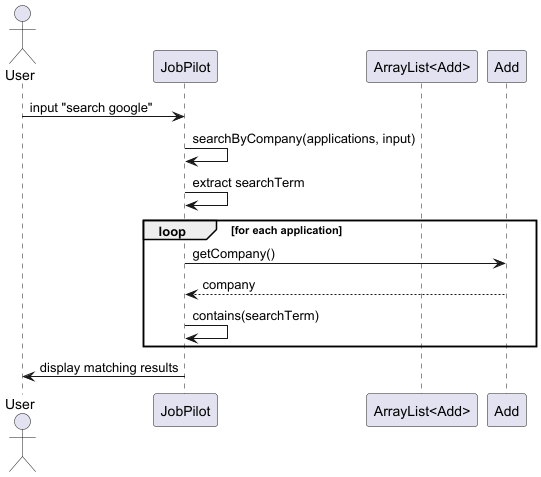
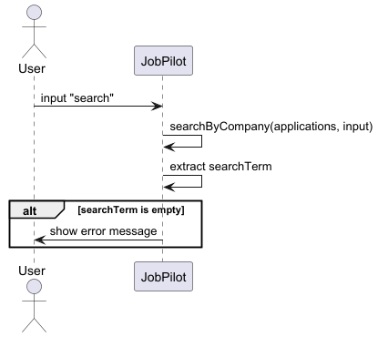
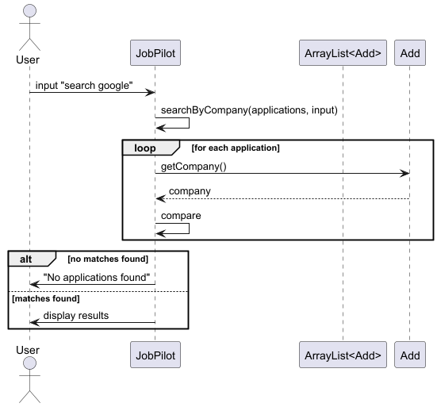

# Developer Guide

## Acknowledgements

{list here sources of all reused/adapted ideas, code, documentation, and third-party libraries -- include links to the original source as well}

## Design

### UI Component

The API of this component is specified in `Ui.java`.

The UI consists of a centralized `Ui` class that serves as the boundary between the user and the system. Since it is a CLI application, it relies on standard input and output.

The `UI` component uses the standard Java `Scanner` to capture user input. The formatting for UI outputs (e.g., the welcome logo, help menus, and application lists) is defined directly within the `Ui` class using text blocks and formatted strings.

The `UI` component,

* reads raw user commands from the console.
* displays formatted messages, search results, and errors to the user based on command execution.
* operates passively; it relies on the `JobPilot` main loop and `CommandRunner` to invoke its specific display methods (e.g., `showApplicationAdded`, `showSearchResults`).
* depends on some classes in the `task` component, as it displays `Application` and `IndustryTag` objects.

### Parser Component

The **Parser** component is responsible for interpreting raw user input and converting it into structured `ParsedCommand` objects.

*Figure 1: Parser Component Architecture*

The following diagram illustrates how the parser processes a typical `edit` command:

*Figure 2: Parser Flow for Edit Command*

### Storage Component

The **API** of this component is specified in `Storage.java`.

The `Storage` component,

* can save job application data in a text format (`.txt`), separated by '|', and read them back into corresponding `Application` objects.
* handles missing directories or files automatically by creating the necessary `data/JobPilotData.txt` file upon initialization if it does not exist.
* parses the text file, actively invalidating corrupted or invalid lines during the loading process to ensure the application does not crash upon startup.
* depends on some classes in the `task` component, because the `Storage` component's primary job is to serialize and deserialize `Application` and `IndustryTag` objects.

### CommandRunner Component

The **CommandRunner** component serves as the central router for all user commands. It receives a `ParsedCommand` object from the `Parser` and delegates execution to the appropriate handler.

The `CommandRunner` component,

* receives a `ParsedCommand` containing command type and relevant parameters (index, search term, status, notes, tag, etc.).
* maintains the central `ArrayList<Application>` that holds all job applications.
* validates command parameters (e.g., index bounds) before delegating to specialized handlers.
* coordinates between the `Ui` and domain logic classes (`Deleter`, `Editor`, `Filterer`, etc.).
* returns a boolean flag to indicate whether the application should continue running.

The following diagram illustrates how the `CommandRunner` processes different command types:

**Key Responsibilities:**

| Responsibility | Description |
|----------------|-------------|
| **Command Routing** | Uses a switch statement to route `ParsedCommand` to the appropriate handler based on `CommandType` |
| **Index Validation** | Validates that indexes are within bounds before passing to handlers |
| **State Management** | Maintains the single source of truth for the application list |
| **Error Handling** | Catches exceptions and delegates error display to `Ui` |

**Command Types Handled:**

| Command Type | Handler | Description |
|--------------|---------|-------------|
| `ADD` | `Application` constructor | Creates new application and adds to list |
| `DELETE` | `Deleter` | Removes application from list |
| `EDIT` | `Editor` | Updates fields of existing application |
| `LIST` | `Ui.showApplicationList()` | Displays all applications |
| `SORT` | `Collections.sort()` | Sorts applications by date |
| `SEARCH` | `JobPilot.searchByCompany()` | Filters applications by company name |
| `FILTER` | `Filterer` | Filters applications by status |
| `STATUS` | `Application.setStatus()` / `setNotes()` | Updates status and/or notes |
| `TAG` | `Application.addIndustryTag()` / `removeIndustryTag()` | Adds or removes industry tags |
| `HELP` | `Ui.showHelp()` | Displays available commands |
| `BYE` | None | Exits the application |

**Design Rationale:**

| Decision | Rationale |
|----------|-----------|
| Centralized command routing | All commands flow through a single component, making the execution flow easy to trace |
| Validation before delegation | Ensures invalid commands never reach domain logic, improving robustness |
| Return boolean flag | Simple mechanism to control main loop continuation without exceptions |
| Switch statement over mapping | Simple, readable, and sufficient for the number of command types |

## Implementation

### Edit Application Feature

#### Sequence Diagram

*Figure 3: Edit Feature Sequence Diagram*

**Error Handling**

| Error Scenario | Condition | User Response |
|----------------|-----------|---------------|
| Missing Index | User enters `edit` without a number | "Please provide an index. Example: edit 1 c/Google" |
| Invalid Index | Index is 0, negative, or exceeds list size | "Invalid application number! You have X application(s)." |
| No Fields | User provides index but no fields to update | "No valid fields to update! Use: c/, p/, d/, s/" |
| Invalid Date Format | Date not in `YYYY-MM-DD` format | "Invalid date! Use YYYY-MM-DD (e.g., 2024-09-12)" |

### Delete Application Feature

#### Implementation Details

The Delete application mechanism is facilitated by the `CommandRunner` component, which manages the application's core state through an `ArrayList<Application>` named `applications`.

The operations are exposed and handled internally via the following flow:

* `DeleterParser#parse(String)` — Parses the raw user input to extract the target index, converting it to a 0-based index and returning a structured `ParsedCommand` object.
* `CommandRunner#run(ParsedCommand)` — Acts as the central router, matching the `DELETE` command type and coordinating between the logic and UI components.
* `Deleter#deleteApplication(ArrayList<Application>, int)` — Validates the array bounds, removes the target `Application` object from the memory list, and returns the removed object.
* `Ui#showApplicationDeleted(Application, int)` — Handles the console output to inform the user of the successful deletion.

Given below is an example usage scenario demonstrating how the Delete mechanism behaves at each step.

**Step 1.** The user executes `delete 2`. The `Ui.readCommand()` method captures the raw input string.

**Step 2.** The input is passed to `Parser.parse()`, which identifies the `delete` keyword and delegates to `DeleterParser.parse()`.

**Step 3.** `DeleterParser` splits the string, extracts the index `"2"`, converts it to a 0-based integer (`1`), and packages it into a `ParsedCommand(type=DELETE, index=1)` object.

**Step 4.** The `CommandRunner#run()` method receives the `ParsedCommand`. The `switch` statement recognizes the `DELETE` type and invokes `Deleter.deleteApplication(applications, cmd.index)`.

**Step 5.** `Deleter` validates that index `1` is within the valid bounds of the `applications` list. It removes the target `Application` object via `applications.remove(1)` and returns the deleted object back to the `CommandRunner`.

**Step 6.** `CommandRunner` receives the deleted `Application` and passes it to `Ui.showApplicationDeleted(removed, applications.size())`, which safely prints the confirmation message to the console.

*Note: If the user inputs a non-numeric index (e.g., `delete abc`), a `NumberFormatException` is caught internally by the `DeleterParser`, which then throws a custom `JobPilotException`. This exception is caught in `Parser`, returning an `ERROR` type `ParsedCommand` that the `Ui` displays.*

The following sequence diagram shows the flow of deleting an application:

#### Design Considerations

**Aspect: Command delegation and Separation of Concerns:**

* **Current Implementation:** The `Deleter` class is strictly responsible for domain logic (removing the `Application` object from the `ArrayList`) and returns the deleted object back to the caller. It does not contain any `System.out.println` statements.
  * *Pros:* High cohesion and loose coupling. By returning the object rather than printing directly, the deletion logic becomes purely functional. This makes `Deleter` extremely easy to unit test and ensures that formatting changes only need to be made in the `Ui` class.
  * *Cons:* Requires a slightly longer call chain (Parser -> Runner -> Deleter -> Ui) compared to a monolithic approach.
* **Alternative:** Have `Deleter.deleteApplication` handle the `ArrayList` removal and print the success message directly to the console.
  * *Pros:* Less boilerplate code and fewer method hand-offs in the `CommandRunner`.
  * *Cons:* Violates the Single Responsibility Principle (SRP) by mixing domain logic with presentation logic, making automated testing difficult and UI migrations (e.g., moving to a GUI) nearly impossible.

### Search by Company Feature

#### Implementation Details

The **Search by Company** feature allows users to retrieve job applications by matching a company name using a **case-insensitive partial search**. This feature is implemented directly within the `JobPilot` class through the method:

* `JobPilot#searchByCompany(ArrayList<Application>, String)`

The application's data is stored in a central `ArrayList<Application>` named `applications`, where each `Application` object represents a job application.

The search operation works by iterating through the list and checking whether each application's company name contains the user-provided search keyword.

---

Given below is an example usage scenario demonstrating how the search mechanism behaves at each step.

**Step 1.** The user executes `search google`. The `Scanner` inside the `JobPilot.main()` loop reads the raw input string.

**Step 2.** The `if-else` execution block in `JobPilot.main()` recognizes the `search` command and routes execution to the `JobPilot#searchByCompany()` method.

**Step 3.** Inside `searchByCompany`, the system extracts the search keyword using:
`String searchTerm = input.substring("search ".length()).trim();`
If the search term is empty, an error message is shown. If the application list is empty, the system informs the user that there are no applications to search.

**Step 4.** The method iterates through all applications and performs a case-insensitive partial match:
for (Application application : applications) {
if (application.getCompany().toLowerCase().contains(searchTerm.toLowerCase())) {
results.add(application);
}
}

**Step 5.** The results are displayed to the user. If no matches are found, the system prints a corresponding message. Otherwise, all matching applications are listed.

---

#### Sequence Diagrams
##### Main Success Flow
The following diagram illustrates the normal execution flow when a user performs a valid search:

##### Empty Search Term
The following diagram shows the system behavior when the user provides an empty search keyword:

##### No Match Found
The following diagram illustrates the case where no applications match the search keyword:

---

**Error Handling**

| Error Scenario | Condition | User Response |
|----------------|-----------|---------------|
| Empty Search Term | User enters `search` without keyword | "Please provide a company name to search. Example: search google" |
| No Applications | Application list is empty | "No applications to search!" |
| No Match Found | No company matches the keyword | "No applications found for company: [keyword]" |
| Invalid Format | Input parsing fails unexpectedly | "Invalid search format! Use: search COMPANY_NAME" |

---

**Design Rationale**

| Decision | Rationale |
|----------|----------|
| Implement search in `JobPilot` | Keeps implementation simple and avoids unnecessary abstraction |
| Case-insensitive matching | Improves usability by allowing flexible input |
| Partial matching using `contains()` | Allows users to search with incomplete company names |
| Linear search on `ArrayList` | Sufficient for small datasets and easy to implement |
| Direct result printing | Simplifies control flow without introducing additional layers |

#### Design Considerations

**Aspect: Search logic placement**

* **Current Implementation:** The search logic is implemented directly inside the `JobPilot` class.
  * *Pros:* Simple and straightforward, easy to integrate with the main command loop.
  * *Cons:* Mixes UI logic and business logic, making the method harder to test and reuse.

---

**Aspect: Matching strategy**

* **Current Implementation:** Uses case-insensitive partial matching via `toLowerCase().contains()`.
  * *Pros:* Flexible and user-friendly, supports partial input (e.g., "goo" matches "Google").
  * *Cons:* Less efficient for large datasets and limited to simple substring matching.

* **Alternative:** Use exact matching with `equalsIgnoreCase()`.
  * *Pros:* More precise and slightly more efficient.
  * *Cons:* Too strict for user input, reduces usability.

---

#### Future Improvements

- Support multi-field search (e.g., company + position)
- Implement fuzzy search to handle typos
- Introduce indexing for faster lookup in large datasets
- Separate search logic into its own component for better modularity

---

### Sort Application Feature

#### Implementation Details

The Sort feature allows users to sort all job applications by date in ascending chronological order. This feature is implemented directly within the `JobPilot` class.

**Command Format**: `sort`

The command does not require any parameters. When executed, all applications are sorted by date automatically.

Example Usage:
- `sort` (Sort all applications by date)

The sorting logic is implemented in the method:

- `JobPilot#sortApplications(ArrayList<Application>)`

Applications are stored in a central `ArrayList<Application>`. The list is sorted using a date comparator: Collections.sort(applications, Comparator.comparing(Application::getDate));

Given below is an example usage scenario:

**Step 1.** The user executes `sort`. Input is read in `JobPilot.main()`.

**Step 2.** The system detects the `sort` command and calls `sortApplications`.

**Step 3.** The method checks if the application list is empty.

**Step 4.** If not empty, the list is sorted in ascending order by date.

**Step 5.** The sorted list is displayed to the user.

---

#### Error Handling

| Error Scenario | Condition | User Response |
|----------------|----------|---------------|
| No Applications | Application list is empty | "No applications to sort!" |

---

#### Design Rationale

| Decision | Rationale |
|----------|----------|
| Sort by date automatically | Most logical for job tracking |
| Ascending order | Ensures earliest applications appear first |
| No command parameters | Keeps command simple and intuitive |
| Use `Collections.sort` | Reliable and easy to maintain |

---

#### Design Considerations

**Aspect: Sorting logic placement**

* **Current Implementation:** Sorting handled in `JobPilot`
  * *Pros:* Simple and direct integration
  * *Cons:* Slight coupling with main class

---

### Tag Industry to Job Application Feature

#### Implementation Details

The Tag feature allows users to add or remove industry tags for job applications. Tags are automatically normalized to uppercase, trimmed of whitespace, and duplicates are automatically prevented. This feature is implemented using a dedicated `IndustryTag` class and integrated with the `Application` model.

**Command Format**:
- `tag INDEX add/TAG` — Add a tag to an application
- `tag INDEX remove/TAG` — Remove a tag from an application

**Example Usage**:
- `tag 1 add/TECH` — Adds tag "TECH" to application at index 1
- `tag 2 remove/FINANCE` — Removes tag "FINANCE" from application at index 2

The feature is implemented using the following components:
- `IndustryTag` — Immutable value object representing a normalized tag
- `Application` — Stores a `Set<IndustryTag>` and provides `addIndustryTag()` and `removeIndustryTag()` methods
- `CommandRunner` — Routes the command to the appropriate handler
- `TagParser` — Parses the raw input to extract index, action, and tag content

Given below is an example usage scenario demonstrating how the Tag mechanism behaves at each step.

**Step 1.** The user executes `tag 1 add/TECH`. The command is read by `Ui` and passed to `Parser`.

**Step 2.** `Parser` identifies the `tag` keyword and delegates to `TagParser.parse()`.

**Step 3.** `TagParser` extracts the index `1`, action `add`, and tag content `TECH`. It returns a `ParsedCommand` object with type `TAG`, index, action, and tag.

**Step 4.** `CommandRunner` receives the `ParsedCommand` and validates the index is within bounds.

**Step 5.** `CommandRunner` calls `Application.addIndustryTag(new IndustryTag("TECH"))` on the target application.

**Step 6.** The `IndustryTag` constructor normalizes the tag (trim → uppercase), and the tag is added to the `Set<IndustryTag>` (duplicates automatically ignored).

**Step 7.** `Ui.showTagAdded()` displays the updated application with its tags.

#### Sequence Diagram

The following sequence diagram illustrates the flow of adding a tag to an application:

#### Error Handling

| Error Scenario | Condition | User Response |
|----------------|-----------|---------------|
| Missing index | User enters `tag add/TECH` without index | "Please provide an index. Example: tag 1 add/TECH" |
| Invalid index | Index is 0, negative, or exceeds list size | "Invalid application number! You have X application(s)." |
| Invalid format | Missing `add/` or `remove/` prefix | "Invalid tag format! Use: tag INDEX add/TAG or tag INDEX remove/TAG" |
| Empty tag | User enters `tag 1 add/` | "Tag cannot be empty!" |
| Remove non-existent tag | Tag not found on application | "Tag not found on this application!" |

#### Design Rationale

| Decision | Rationale |
|----------|----------|
| Dedicated `IndustryTag` class | Encapsulates tag normalization logic (uppercase, trim) and ensures immutability |
| Use `Set<IndustryTag>` | Automatically prevents duplicate tags |
| Tag normalization (uppercase) | Ensures consistency and prevents case-sensitive duplicates |
| `add/` and `remove/` syntax | Matches existing command patterns (`set/`, `note/`) |
| Separate `TagParser` | Maintains separation of concerns and simplifies unit testing |

### Filter by Status Feature

#### Implementation Details

The **Filter by Status** mechanism allows users to retrieve a subset of applications matching a specific status (e.g., "OFFER"). This is implemented via a dedicated `Filterer` utility class and a `FilterParser` sub-parser, following the **Separation of Concerns** principle used in the `Delete` and `Edit` features.

The operations are handled via the following methods:
* `FilterParser#parse(String)` — Extracts the status query from the raw input (e.g., extracts "OFFER" from `filter status/OFFER`).
* `Filterer#filterByStatus(ArrayList<Application>, String, Ui)` — Iterates through the list, performs the logical match, and delegates the display to the `Ui` class.

**Execution Scenario**

**Step 1.** The user executes `filter status/OFFER`. The `Scanner` in `JobPilot.main()` reads the input string.

**Step 2.** The `Parser` identifies the `filter` keyword and routes execution to `FilterParser.parse("filter status/OFFER")`.

**Step 3.** `FilterParser` validates the `status/` prefix, extracts the string `"OFFER"`, and returns a `ParsedCommand` object with `type = FILTER` and `searchTerm = "OFFER"`.

**Step 4.** The `switch` block in `JobPilot.main()` catches the `FILTER` case and calls `Filterer.filterByStatus(applications, cmd.searchTerm, ui)`.

**Step 5.** The `Filterer` iterates through the `ArrayList<Application>`. For each application, it performs a case-insensitive check:
`app.getStatus().toUpperCase().contains(query.toUpperCase())`.

**Step 6.** Matching applications are added to a temporary results list, which is then passed to `ui.showApplicationList(results)` for final display.

#### Sequence Diagram

The following sequence diagram illustrates the flow of filtering applications by status:

#### Design Rationale

| Decision | Rationale |
|----------|-----------|
| **Separate `Filterer` Class** | Maintains the Single Responsibility Principle and simplifies unit testing. |
| **Case-Insensitive `contains()`** | Provides a "search-like" experience, allowing partial matches (e.g., "OFF" matches "OFFER"). |

#### Error Handling

| Error Scenario | Condition | User Response |
|----------------|-----------|---------------|
| Missing Arguments | User enters `filter` alone | "Filter command is missing arguments! Use: filter status/STATUS" |
| Missing Prefix | User enters `filter PENDING` | "Invalid filter format! Expected: filter status/STATUS" |
| Empty Value | User enters `filter status/` | "Status value cannot be empty!" |
### Separate Notes from Status Feature

#### Implementation Details

This feature separates the original `status` field into two independent fields: `status` (application progress) and `notes` (user comments). This allows users to update status and notes independently without overwriting the other.

**Command Format**: `status INDEX set/STATUS note/NOTES`

**Example Usage**:
- `status 1 set/OFFER note/Negotiate salary` — Update both status and notes
- `status 2 set/INTERVIEW` — Update status only (notes unchanged)
- `status 3 note/Follow up next week` — Update notes only (status unchanged)

The feature is implemented using the following components:
- `Application` — Stores `status` and `notes` as separate fields with getter/setter methods
- `StatusParser` — Parses the raw input to extract index, status value, and notes
- `CommandRunner` — Routes the command and updates the target application

Given below is an example usage scenario demonstrating how the Status mechanism behaves at each step.

**Step 1.** The user executes `status 1 set/OFFER note/Negotiate salary`. The command is read by `Ui` and passed to `Parser`.

**Step 2.** `Parser` identifies the `status` keyword and delegates to `StatusParser.parse()`.

**Step 3.** `StatusParser` extracts the index `1`, status value `OFFER` (after `set/`), and notes `Negotiate salary` (after `note/`). It returns a `ParsedCommand` object with type `STATUS`, index, status, and notes.

**Step 4.** `CommandRunner` validates the index is within bounds and retrieves the target `Application`.

**Step 5.** `CommandRunner` calls `app.setStatus(status)` if status is provided, and `app.setNotes(notes)` if notes are provided.

**Step 6.** `Ui.showStatusUpdated(app)` displays the updated application.

#### Sequence Diagram

The following sequence diagram illustrates the flow of updating status and notes:

#### Error Handling

| Error Scenario | Condition | User Response |
|----------------|-----------|---------------|
| Missing index | User enters `status set/OFFER` without index | "Please provide an index. Example: status 1 set/OFFER" |
| Invalid index | Index out of range | "Invalid application number! You have X application(s)." |
| Invalid format | Missing `set/` or incorrectly formatted | "Invalid status format! Use: status INDEX set/STATUS note/NOTE" |
| Empty status | User enters `status 1 set/` | "Status cannot be empty!" |
| Both fields missing | User enters `status 1` | "No valid fields to update! Use: set/STATUS and/or note/NOTE" |

#### Design Rationale

| Decision | Rationale |
|----------|----------|
| Separate `status` and `notes` fields | Improves data clarity and allows independent updates |
| Optional `note/` field | Supports updating status without overwriting existing notes |
| Backward compatibility | Existing applications with combined format are migrated correctly |
| Dedicated `StatusParser` | Maintains separation of concerns and simplifies testing |
| `set/` and `note/` prefixes | Consistent with existing command patterns (`c/`, `p/`, `d/`) |

## Product Scope
### Target User Profile
Computing students applying for jobs and want to keep track of their applications.

### Value Proposition
In the current job market, applying to many roles has become the norm. As such, JobPilot acts a
tracker to allow users to get a bird's eye view of all their applications and manage them effectively.

## User Stories

### Version 1.0 (Core Features)

| Version | As a ... | I want to ...                                                     | So that I can ...                      |
|------|----------|-------------------------------------------------------------------|----------------------------------------|
| v1.0 | user | add a job application with company, position, and submission date | keep track of where I have applied     |
| v1.0 | user | list all my applications                                          | see a summary of my applications       |
| v1.0 | user | delete applications                                               | manage my application list effectively |
| v1.0 | user | update application status                                         | track my application progress          |
| v1.0 | user | sort applications by submission date                              | prioritize older applications          |

### Version 2.0 (Enhanced Features)

| Version | As a ... | I want to ... | So that I can ...                                          |
|---------|----------|---------------|------------------------------------------------------------|
| v2.0 | user | store my applications persistently | come back to it at different points in time                |
| v2.0 | user | edit an existing application | update details without deleting and re-adding applications |
| v2.0 | user | search applications by company name | locate applications for specific companies                 |
| v2.0 | user | add industry tags to applications | categorize applications by industry                        |
| v2.0 | user | filter applications by status | focus on applications at a specific stage                  |

## Non-Functional Requirements

### 1. Performance
- The application shall respond to any command (add, edit, delete, search, sort, tag, status) within **1 second** for up to **500 job applications**.
- Searching, sorting, and filtering operations shall execute in **O(n)** time complexity or better, where n is the number of applications.

### 2. Usability
- Command syntax shall remain consistent with clear prefixes (`c/`, `p/`, `d/`, `s/`, `add/`, `remove/`, `note/`) to minimize user errors.
- Error messages shall be **descriptive and actionable**, guiding users to correct input mistakes.
- Commands shall support **partial input** where applicable (e.g., partial company names for search).

### 3. Accessibility
- Command-line outputs shall be **readable with standard font sizes**, use clear formatting (tables, line breaks), and avoid color dependence.
- Messages shall be concise, avoiding technical jargon when addressing end users.

## Glossary

* **CLI** - Command Line Interface.
* **Filter** - A function to narrow down the application list based on specific criteria.
* **Tag** - A label assigned to an application for categorization.

## Instructions for manual testing

{Give instructions on how to do a manual product testing e.g., how to load sample data to be used for testing}

## Initial Launch
1. Use the provided `JobPilot.jar`.
2. Place the jar in an empty folder.
3. **Double-click the jar file**  
   **Expected:** JobPilot launches. The CLI prompt appears showing either an empty list or existing applications if data file exists.

### Edit Feature Testing

| Test          | Command | Expected |
|---------------|---------|----------|
| Edit company  | `edit 1 c/Microsoft` | Company updated |
| Edit position | `edit 1 p/Senior Engineer` | Position updated |
| Edit date     | `edit 1 d/2024-12-01` | Date updated |
| Edit status   | `edit 1 s/Interview` | Status updated to Interview |
| Edit multiple | `edit 1 c/Google p/SWE d/2024-09-12` | All fields updated |
| Invalid index | `edit 99 c/Google` | Error: invalid index |
| No fields     | `edit 1` | Error: no fields to update |
| Invalid date  | `edit 1 d/2024-13-01` | Error: invalid date format |

### Search by Company Feature Testing

| Test | Command | Expected |
|------|--------|----------|
| No match | `search Microsoft` | Prints "No applications found for company: Microsoft" |
| Exact match | `search Google` | Shows 1 result with Google application only |
| Partial match | `search Go` | Shows multiple results (e.g., Google, GoGoTravel) |
| Case insensitive | `search GOOGLE` | Matches "Google" successfully |
| Empty search term | `search ` | Error: "Please provide a company name to search" |
| Empty list | `search Google` (no applications) | "No applications to search!" |

### Filter by Status Feature Testing

| Test | Command | Expected |
|------|---------|----------|
| Exact match | `filter status/OFFER` | Shows only applications with status "OFFER" |
| Case insensitive | `filter status/offer` | Matches "OFFER" successfully |
| Partial match | `filter status/PEND` | Matches "PENDING" successfully |
| No match | `filter status/REJECTED` | Prints "No applications found for status: REJECTED" |
| Empty list | `filter status/OFFER` | Prints "There is no application yet." |

### Delete Feature Testing

#### Test case: `delete 1`

- **Action:** Enter `delete 1`
- **Expected:**
  - First application removed from list.
  - `Ui.showApplicationDeleted()` shows the deleted application and remaining count.
  - `Storage.saveToFile()` updates `JobPilotData.txt`.

#### Test case: `delete 0`

- **Action:** Enter `delete 0`
- **Expected:**
  - Error thrown.
  - No deletion occurs.
  - Storage remains unchanged.

#### Test case: `delete` (no index)

- **Action:** Enter `delete`
- **Expected:**
  - Error thrown.
  - No deletion.
  - Data file remains unchanged.

#### Test case: `delete x` (non-numeric index)

- **Action:** Enter `delete abc`
- **Expected:**
  - Error thrown.
  - No deletion.
  - Storage remains consistent.

#### Test case: `delete N+1` (index out of range)

- **Action:** Enter index greater than list size
- **Expected:**
  - Error thrown.
  - No deletion occurs.
  - Data file unchanged.

### Storage Feature Testing

1. Perform `add`, `edit`, or `delete` command.  
   **Expected:**
- `Storage.saveToFile()` is called.
- `JobPilotData.txt` updated with the latest application list.
- On next launch, the list reflects all modifications.
