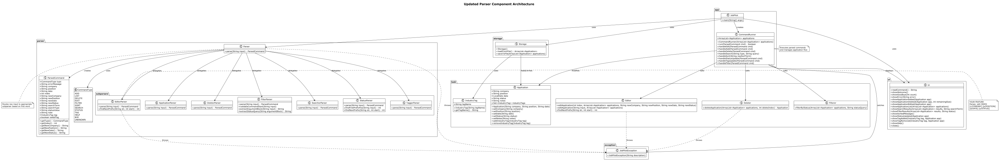
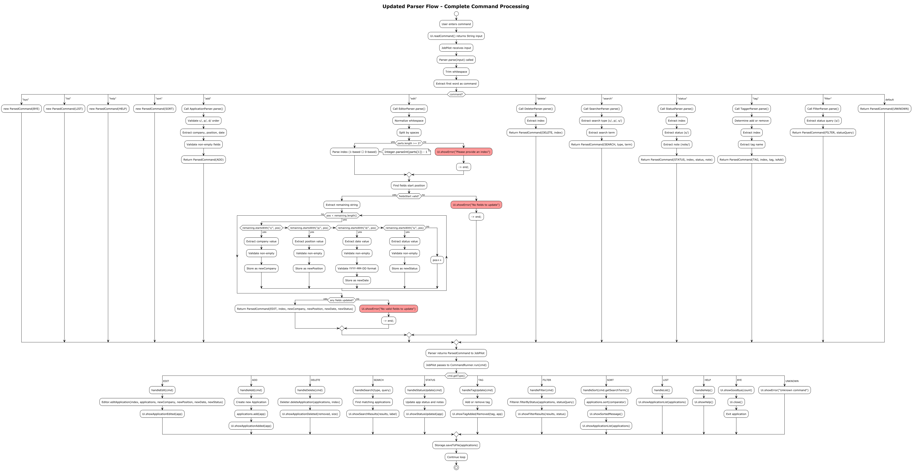
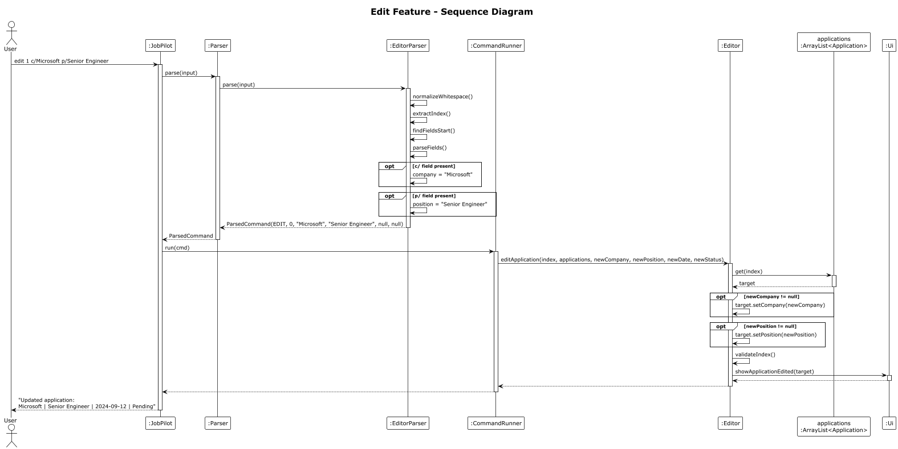

# Labelle's Project Portfolio Page

## Overview
JobPilot is a CLI application for job seekers to track applications efficiently. Users can add, edit, delete, search, and sort applications with status tracking and industry tags.

I led the implementation of the editor feature, designed and built the modular parser system, and enhanced the application model to support mutable fields.

### Summary of Contributions
*[Link to code on tP Code Dashboard.](https://nus-cs2113-ay2526-s2.github.io/tp-dashboard/?search=lab3ll3&sort=groupTitle&sortWithin=title&timeframe=commit&mergegroup=&groupSelect=groupByRepos&breakdown=true&checkedFileTypes=docs~functional-code~test-code~other&since=2026-02-20T00%3A00%3A00&filteredFileName=&tabOpen=true&tabType=authorship&tabAuthor=lab3ll3&tabRepo=AY2526S2-CS2113-W13-3%2Ftp%5Bmaster%5D&authorshipIsMergeGroup=false&authorshipFileTypes=docs~functional-code~test-code~other&authorshipIsBinaryFileTypeChecked=false&authorshipIsIgnoredFilesChecked=false)

### Enhancements Implemented
#### Application Model Enhancement
Enhanced Application class with setters and tag support.

Key Features:
- Setters: setCompany, setPosition, setDate, setStatus, setNotes
- Integrated IndustryTag for categorization 
- Input validation and assertions

#### Editor Application Feature
Modify existing applications – update company, position, date, or status in one command.

Format: edit INDEX [c/COMPANY] [p/POSITION] [d/DATE] [s/STATUS]

Key Features:
- Partial updates (only specified fields change)
- Handles multi‑word inputs (e.g., "Senior Software Engineer")
- Validates YYYY-MM-DD date format 
- Clear error messages for invalid indices or empty fields

Why it's complete:
- Supports any combination of fields (e.g., update only company, or all four at once)
- Handles multi-word values (e.g., "Senior Software Engineer") correctly 
- Validates date format (YYYY-MM-DD) and rejects invalid dates 
- Provides clear error messages for invalid indices, empty fields, and malformed input 

Implementation complexity:
- Required designing a prefix-based parser that extracts fields without breaking on spaces 
- Needed careful whitespace normalisation to handle user input with extra spaces 
- Involved adding setter methods to the Application class while preserving immutability where needed 
- Integrated with existing command loop without breaking other features

#### Parser System Refactoring
Modular parser that routes commands to dedicated subparsers.

Key Features:
- Parser class with CommandType enum 
- ParsedCommand data class for clean command data 
- Prefix‑based parsing (c/, p/, d/, s/) that preserves spaces in values 
- Subparsers: ApplicationParser, DeleterParser, EditorParser, etc.

Why it's complete:
- Encapsulates all parsing logic in one place, separate from command execution
- Uses a CommandType enum for clean routing
- Returns a ParsedCommand object containing all parsed data 
- Subparsers (AddParser, DeleteParser, EditParser, etc.) each handle one command, making the system easy to extend

Implementation complexity:
- Designed a prefix-based parsing algorithm that correctly captures multi-word values (e.g., c/Amazon Web Services)
- Implemented robust error handling so malformed commands produce user-friendly messages 
- Created a flexible ParsedCommand data class that supports different constructors for different command types 
- Ensured the parser works consistently across all commands, reducing duplicate code

### Team Contributions
- Communicator for the team (set internal deadlines, set todos for team)
- Helped resolve merge conflicts in JobPilot.java 

## Contributions to Developer Guide
### Parser Component

The **Parser** component is responsible for interpreting raw user input and converting it into structured `ParsedCommand` objects.

*Figure 1: Parser Component Architecture*

The following diagram illustrates how the parser processes a typical `edit` command:

*Figure 2: Parser Flow for Edit Command*

### Edit Application Feature

#### Sequence Diagram

*Figure 3: Edit Feature Sequence Diagram*

**Error Handling**

| Error Scenario | Condition | User Response |
|----------------|-----------|---------------|
| Missing Index | User enters `edit` without a number | "Please provide an index. Example: edit 1 c/Google" |
| Invalid Index | Index is 0, negative, or exceeds list size | "Invalid application number! You have X application(s)." |
| No Fields | User provides index but no fields to update | "No valid fields to update! Use: c/, p/, d/, s/" |
| Invalid Date Format | Date not in `YYYY-MM-DD` format | "Invalid date! Use YYYY-MM-DD (e.g., 2024-09-12)" |

### User Stories
| Version | As a ... | I want to ...                                                     | So that I can ...                      |
|------|----------|-------------------------------------------------------------------|----------------------------------------|
| v1.0 | user | add a job application with company, position, and submission date | keep track of where I have applied     |
| v1.0 | user | list all my applications                                          | see a summary of my applications       |
| v1.0 | user | delete applications                                               | manage my application list effectively |
| v1.0 | user | update application status                                         | track my application progress          |
| v1.0 | user | sort applications by submission date                              | prioritize older applications          |
| v2.0 | user | store my applications persistently | come back to it at different points in time                |
| v2.0 | user | edit an existing application | update details without deleting and re-adding applications |
| v2.0 | user | search applications by company name | locate applications for specific companies                 |
| v2.0 | user | add industry tags to applications | categorize applications by industry                        |
| v2.0 | user | filter applications by status | focus on applications at a specific stage                  |

## Contributions to User Guide
### Adding an application: add
Adds a new job application to JobPilot.

Format: add c/COMPANY p/POSITION d/DATE
- c/COMPANY - Name of the company
- p/POSITION - Job title/position
- d/DATE - Application submission date in YYYY-MM-DD format

Example:
add c/Google p/SE manager d/2025-03-10

Example output:
Added: Google | SE manager | 2025-03-10 | Pending

### Editing an application: edit
Edits an existing application's fields. Only specified fields will be updated.

Format: edit INDEX [c/COMPANY] [p/POSITION] [d/DATE] [s/STATUS]

- INDEX - Position of the application in the list (from list command)
- c/COMPANY - (Optional) New company name
- p/POSITION - (Optional) New position title
- d/DATE - (Optional) New submission date in YYYY-MM-DD format
- s/STATUS - (Optional) New status

Examples:
- edit 1 c/Apple - Change company only
- edit 2 p/Senior Engineer - Change position only
- edit 3 d/2027-01-09 - Change date only
- edit 1 c/Google p/SWE d/2024-09-12 s/Offer - Change multiple fields

Example output:
Updated application:
Apple | SE manager | 2025-03-10 | OFFER (Note: Negotiate salary) | Tags: [TECH]

